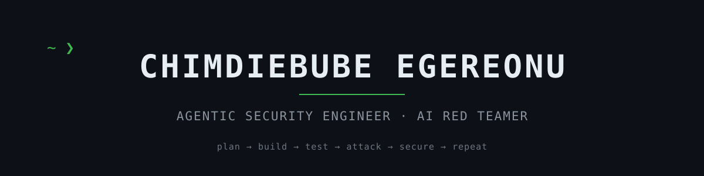

**I break AI agents, then build them back — hardened.**

 

 
 

**NOW**

Building `tilde ~` — a model-agnostic agentic harness for security engineering.
 Every day of work lands as a commit.

 

**FOCUS**

AI red teaming — prompt injection · tool poisoning · memory extraction · agent hijacking
 App & API security — bug bounties on AI programs
 Agentic engineering — Python · Linux · podman · Ollama

 

**FIND ME**

[LinkedIn](https://www.linkedin.com/in/chimdiebube-egereonu-b09124390/) · [X — @chimdiVuln](https://x.com/chimdiVuln) · [rootmaze0x@gmail.com](mailto:rootmaze0x@gmail.com)

